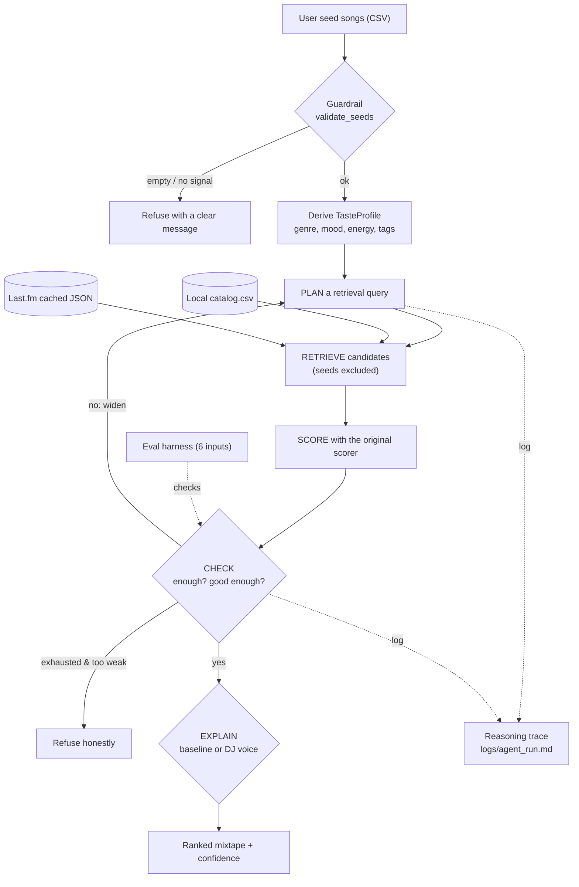

# 🎧 DJ Agentic Roboto — Mixtape Taste Maker

> An applied AI system for CodePath AI110 (Project 4). It learns your music taste
> from a handful of songs you already like, then an **agent** plans a search,
> retrieves candidates, **checks its own picks**, and builds you a mixtape — always
> explaining *why*, and refusing when it has nothing good.

## The base project this extends (Modules 1–3)

**Original project:** *Music Recommender Simulation* (CodePath AI110, Week 6) — a
command-line, **content-based** recommender. It loads 20 songs from
`data/songs.csv`, scores each against a hand-written taste profile on genre / mood /
energy, and returns a ranked list with a plain-English reason for every score. Its
soul is **explainable scoring**: you can always answer "why this song?" (The full
original documentation is preserved further down this file.)

## What this version adds

DJ Agentic Roboto keeps that explainable scorer as the **brain** and wraps a full
applied AI system around it:

| New component | What it does |
| --- | --- |
| **Taste profile derivation** (`src/profile.py`) | Learns your profile *from seed songs you like*, instead of a hand-written dictionary. |
| **Agentic loop** (`src/agent.py`) — *the required AI feature* | Plans a query → retrieves → **checks its own picks** → widens or **refuses** → explains, with a reasoning trace. |
| **Multi-source retrieval / RAG** (`src/lastfm.py`) | Local catalog **+ live-or-cached Last.fm** real tracks. |
| **Confidence + guardrails** (`src/guardrails.py`) | Rates its own certainty; refuses empty or signal-less input and no-good-match cases. |
| **Specialized "DJ voice"** (`src/explain.py`) | A second explanation style anchored to your seed songs. |
| **Evaluation harness** (`src/evaluate.py`) | Runs 6 predefined inputs and prints a pass/fail + confidence report. |

The single AI feature required by the brief is the **agentic loop**; the other four
components implement the optional stretch features (agentic traces, RAG multi-source,
specialization, test harness).

## Architecture



Data flows **input → process → output**: seed songs enter, a guardrail validates
them, a taste profile is derived, and the agent loops plan→retrieve→check→refine
over two retrieval sources until it has a strong set (or honestly refuses). The
original scorer ranks every candidate; an explanation renderer produces the final
"why". Reasoning traces are logged, and the evaluation harness checks the whole
path. Diagram source: [`diagrams/architecture.mmd`](diagrams/architecture.mmd).

## Setup

No third-party dependencies — Python standard library only.

```bash
python3 -m venv .venv
source .venv/bin/activate
```

Run the system on the example library:

```bash
python -m src.app                        # baseline explanations
python -m src.app --voice dj             # DJ-voice explanations
python -m src.app --seeds my_songs.csv   # your own library (same CSV columns)
python -m src.app --k 8 --no-lastfm      # local catalog only
```

Run the tests and the evaluation harness:

```bash
python -m pytest -q
python -m src.evaluate
```

**Last.fm (optional).** The system runs fully offline against a committed cache
(`data/lastfm_cache.json`), so **no key is needed to run or grade it**. To fetch
live instead, get a free key at <https://www.last.fm/api/account/create>, copy
`lastfm_api_key.example.txt` → `lastfm_api_key.txt` (gitignored), and paste your
key. A run reports `Last.fm (live)` with a key and `Last.fm (cached)` without one —
the recommendations are the same either way.

## Sample interactions (real program output)

### 1. Learns your taste and builds a mixtape (DJ voice)

```text
$ python -m src.app --voice dj
Loaded 12 seed song(s) and 38 catalog song(s).

Your taste, learned from your seeds:
  Derived from 12 seed song(s). Dominant genre: new jack swing (4/12). Dominant mood: happy (5/12). Average energy: 0.77. Leans 1990s. Signature tags: happy, dance, club, smooth, intense.

Last.fm (live) added 60 real candidate(s) to the pool.

Agent worked through 1 search step(s). Confidence: HIGH (1.00).

Your mixtape (top 5), voice: dj:
  1. Poison - Bell Biv DeVoe [new jack swing] (score 4.67)
       because: Cued up Poison because it rides the same new jack swing as your Payday Swing.
  2. My Prerogative - Bobby Brown [new jack swing] (score 4.20)
       because: My Prerogative lands next to your Cassette Crush - same new jack swing energy.
  3. Just Got Paid - Johnny Kemp [new jack swing] (score 4.19)
       because: Just Got Paid lands next to your Payday Swing - same new jack swing energy.
  4. Rump Shaker - Wreckx-n-Effect [new jack swing] (score 3.67)
       because: Rump Shaker lands next to your Payday Swing - same new jack swing energy.
  5. I Want Her - Keith Sweat [new jack swing] (score 3.18)
       because: I Want Her lands next to your Backspin Romance - same new jack swing energy.
```

### 2. Multi-source retrieval keeps the mixtape on-genre (RAG before/after)

Asked for 8 songs, the **local catalog runs out of new jack swing** and the list
drifts to eurodance / hip hop / latin pop. Adding **Last.fm** keeps all 8 on-genre
with real discovered tracks (Janet Jackson, Jade, Soul for Real). Full logs:
[`logs/samples/before_local_only.txt`](logs/samples/before_local_only.txt) and
[`logs/samples/after_with_lastfm.txt`](logs/samples/after_with_lastfm.txt).

```text
BEFORE  ($ python -m src.app --k 8 --no-lastfm)      # 3 of 8 on-genre
  1. Poison - Bell Biv DeVoe [new jack swing]  (4.67)
  2. My Prerogative - Bobby Brown [new jack swing]  (4.20)
  3. Just Got Paid - Johnny Kemp [new jack swing]  (4.19)
  4. Dancing Satellite - Bella Volt [eurodance]  (2.85)
  5. Golden Era Glow - Dusty Vinyl [hip hop]  (2.74)
  6. Real Love - Mary J. Blige [r&b]  (2.70)
  7. Sol y Sombra - Grupo Marea [latin pop]  (2.50)
  8. Backseat Comets - Indigo Parade [indie pop]  (2.48)

AFTER   ($ python -m src.app --k 8)                  # 8 of 8 on-genre
  1. Poison - Bell Biv DeVoe [new jack swing]  (4.67)
  2. My Prerogative - Bobby Brown [new jack swing]  (4.20)
  3. Just Got Paid - Johnny Kemp [new jack swing]  (4.19)
  4. Rump Shaker - Wreckx-n-Effect [new jack swing]  (3.67)
  5. I Want Her - Keith Sweat [new jack swing]  (3.18)
  6. Alright - Janet Jackson [new jack swing]  (2.00)     <- via Last.fm
  7. Don't Walk Away - Jade [new jack swing]  (2.00)      <- via Last.fm
  8. Every Little Thing I Do - Soul for Real [new jack swing]  (2.00)  <- via Last.fm
```

### 3. Guardrail: refuses empty input instead of guessing

```text
$ python -m src.app --seeds data/seeds_empty_example.csv
[guardrail] No seed songs provided - give me a few songs you like.
```

## Reliability / evaluation results

`python -m src.evaluate` runs the whole pipeline against six predefined inputs,
including the cases where the *correct* behavior is to refuse
([`logs/eval_report.md`](logs/eval_report.md)):

| Case | Input | Expected behavior | Confidence | Result |
| --- | --- | --- | --- | --- |
| typical_taste | 5 coherent NJS / freestyle seeds | full set, medium/high confidence | high (1.00) | PASS |
| too_few_seeds | only 2 seeds | still answers, flags low/medium | medium (0.60) | PASS |
| empty_input | no seed songs | guardrail blocks | blocked | PASS |
| garbage_rows | rows with no genre/mood/energy | guardrail blocks | blocked | PASS |
| genre_not_in_catalog | a cumbia taste (catalog has ~none) | widens 2+ steps, still answers | low (0.36) | PASS |
| nothing_fits | dance taste vs ambient-only crate | honestly refuses | none (0.00) | PASS |

**6 of 6 checks passed.**

## Design decisions & trade-offs

- **The original scorer stays the decision-maker.** The agent only decides *what to
  retrieve*; ranking is still the transparent Week-6 scorer. This avoids "the AI
  picks the songs and the scorer just decorates" drift and keeps every pick explainable.
- **Deterministic, no LLM.** The whole system is rule-based, so runs are reproducible
  and gradeable without an API key. The trade-off: mood parsing is keyword/attribute
  based, not natural-language.
- **Last.fm tags → genre/mood only; energy left blank.** Last.fm gives tags, not
  audio features, so retrieved tracks are scored only on what Last.fm actually
  asserts. We never fabricate an energy number, so they rank below fully-attributed
  local songs — a fair reflection of less information.
- **Honest refusal + confidence.** A score floor makes the agent decline rather than
  force a weak match, and every run rates its own confidence (lowered for thin seed
  sets or widened searches).
- **Catalog is a real + fictional mix; features are approximate.** See the model card.

## Testing summary

24 automated tests pass (`python -m pytest -q`) across taste derivation, the agent
loop (widening, seed de-duplication, honest refusal), both explanation voices, the
input guardrail, and offline Last.fm / multi-source merge. The evaluation harness
adds 6 end-to-end behavior checks (6/6). **What worked:** the agent reliably widens
and refuses as designed, and offline caching makes Last.fm reproducible. **What was
hard:** aligning Last.fm's tag vocabulary with the scorer's genre/mood/energy signals
— resolved by tagging retrieved tracks with only the asserted field and leaving
energy unknown. **What surprised us:** community tags are noisy (Sabrina Carpenter
and NewJeans show up under "new jack swing"), which is documented as a limitation.

## Reflection

The graded responsible-AI reflection — how AI was used during development, one
helpful and one flawed AI suggestion, and the system's limitations and biases — is
in [`model_card.md`](model_card.md).

---

# 📼 The Original Project (Week 6 Base)

*The full original documentation is preserved below, unchanged.*

## Project Summary

A command-line, content-based music recommender built for CodePath AI110.

It loads a catalog of 20 songs from `data/songs.csv`, compares each song against a
user taste profile, and returns a ranked list of recommendations with a plain-English
reason for every score. There is no listening history and no other users involved —
recommendations come entirely from the attributes of the songs themselves.

The catalog mixes the ten fictional songs from the starter project with ten real
tracks, mostly late-80s and 90s new jack swing, freestyle, hip hop, and eurodance.
That mix is deliberate: it lets the evaluation test the system against music with
known, real-world relationships between songs.

---

## How Real Recommenders Work

Services like Spotify and YouTube face the same basic problem: millions of items, one
person, one screen. There are two fundamentally different ways to decide what to show,
and real systems use both.

### Content-based filtering

Describe the item, describe the listener's taste, and compare them. A song is reduced to
features — genre, mood, tempo, energy, how acoustic it sounds — and recommended when
those features line up with what the listener wants.

Spotify produces these features by machine: neural networks analyse the raw audio and
output values for tempo, energy, danceability, and acousticness. Those are the same
field names used in this project's `songs.csv`, which is modelled on that format. The
difference is that a streaming service measures them from the audio, while the values
here were assigned by hand.

### Collaborative filtering

This approach ignores what a song *is* and looks only at who listened to it. Imagine a
large table where each row is a listener, each column is a song, and a mark means that
person played it:

```text
              Creep   On Our Own   Barbie Girl   Romantic
  You           x          x             .           .
  Listener B    x          x             .           x
  Listener C    .          .             x           .
```

Listener B's row looks like yours, and they played "Romantic" — so "Romantic" is
recommended to you. Nothing about the song's genre, mood, or energy was used. The
connection came entirely from behaviour.

Importantly, this behaviour is usually **implicit feedback** rather than ratings.
Spotify relies mostly on signals like play counts, skips, playlist adds, and artist page
visits — what a listener does, rather than what they say they like.

In practice, large services combine both. Spotify's Discover Weekly blends collaborative
filtering over listening behaviour, natural language processing over text written about
music online, and audio analysis of the tracks themselves.

### Input data, preferences, and ranking are three separate things

It helps to keep three ideas apart:

1. **Input data** — the songs and their attributes. Facts about items.
2. **User preferences** — a description of one listener, either stated directly
   ("I like high-energy pop") or inferred from listening history.
3. **Ranking and selection** — scoring every candidate, sorting, and choosing how many
   to show. A score means nothing on its own; it only matters relative to the others.

At scale, step 3 is usually split in two. YouTube's published architecture first runs
**candidate generation**, narrowing millions of videos to a few hundred using watch
history and context, then runs a **ranking** model that scores those few hundred
precisely and orders them.

### Where this project fits

This project is content-based only, and that is a structural fact rather than a
shortcut: there are no users, no play counts, and no ratings in the dataset, so there is
no behavioural data for collaborative filtering to work with.

It also has no candidate-generation stage, because a 20-song catalog can be scored in a
single pass. `score_song` and `recommend_songs` correspond to the ranking stage above.

This choice has one real advantage worth naming. **Cold start** is the problem of
recommending when there is no history. A brand-new song has no listeners, so
collaborative filtering cannot place it — but a content-based system can recommend it
immediately, because it has attributes from the moment it exists. The same applies to a
brand-new listener: they have no history, but they can state a genre, a mood, and an
energy level, which is exactly what the `user_prefs` dictionary in this project holds.

*Further reading:* [Deep Neural Networks for YouTube Recommendations](https://research.google/pubs/deep-neural-networks-for-youtube-recommendations/)
(Covington, Adams & Sargin, RecSys 2016);
[Behind Spotify's Discover Weekly](https://blogs.cornell.edu/info2040/2019/10/22/behind-spotifys-discover-weekly-playlist/)
(Cornell INFO 2040 course blog).

---

## How The System Works

### The data

Each song in `data/songs.csv` carries fifteen fields:

| Type | Fields |
| --- | --- |
| Text (categorical) | `title`, `artist`, `genre`, `mood`, `decade`, `mood_tags`, `language` |
| Numeric | `id`, `tempo_bpm`, `energy`, `valence`, `danceability`, `acousticness`, `year`, `popularity` |

The four 0–1 numeric features imitate the audio-analysis values a streaming service
would compute from a waveform. **In this project they were assigned by hand, not
measured.** Only the `tempo_bpm` values for the real songs were looked up.

Five fields were added as a stretch feature: `year`, `decade`, `popularity` (0–100),
`mood_tags` (a semicolon-separated list like `happy;confident;funky`), and `language`.
Release years for the ten real songs are real; years for the ten fictional songs are
invented. Popularity values are estimates — informed by chart performance for the real
songs (e.g. "California Love" and "Barbie Girl" rank high), invented for the fictional
ones.

A user profile stores an *ideal*, not a history:

```python
{"genre": "new jack swing", "mood": "happy", "energy": 0.80}
```

Because the profile and the songs use the same vocabulary, they can be compared
field by field.

### The scoring recipe

Three signals combine into one score:

| Signal | Points | Rule |
| --- | --- | --- |
| Genre match | **+2.0** | Exact match, case-insensitive |
| Mood match | **+1.0** | Exact match, case-insensitive |
| Energy similarity | **+0.0 to +1.0** | `max(0.0, 1.0 - abs(song_energy - target_energy))` |

Two optional signals score **only when the profile asks for them**, so profiles that
do not mention them are completely unaffected:

| Optional signal | Points | Rule |
| --- | --- | --- |
| Decade match | **+0.5** | Profile's `decade` equals the song's, e.g. `"1980s"` |
| Mood-tag overlap | **+0.25 per tag, capped at +0.5** | Profile's `tags` list vs the song's `mood_tags` |

Base scores range from **0.0 to 4.0** (up to 5.0 with the optional signals). Identical
energy earns the full `1.0`; energy at the opposite extreme earns `0.0`. The
`max(0.0, ...)` clamp means a malformed value can never subtract from a score. Missing
or unparseable data earns nothing rather than being treated as zero, so a song is never
rewarded for absent information.

The weights are deliberate: **genre alone (2.0) outweighs mood and energy combined
(2.0 max, and only when both are perfect).** Genre effectively acts as a gate. This
keeps results predictable and easy to explain, but it produces real failures — see
Limitations.

### Ranking modes

The weights above belong to the default **balanced** mode. Ranking strategies follow a
simple Strategy pattern: each mode is a named `RankingMode` object holding a set of
weights, and `score_song` consults the active mode — switching strategy never means new
scoring code, only different numbers flowing through the same logic.

| Mode | Behaviour |
| --- | --- |
| `balanced` | The default recipe: genre 2.0, mood 1.0, energy 1.0 |
| `mood-first` | Mood dominates (2.0); genre becomes a small nudge (0.5) |
| `energy` | Pure energy similarity (×3.0); categorical labels ignored |
| `crowd-pleaser` | The balanced recipe plus up to +1.5 scaled by `popularity`/100 |

Switch modes from the command line:

```bash
python -m src.main --mode crowd-pleaser
```

On the NJS Party profile, `crowd-pleaser` visibly reorders results: "Romantic"
(popularity 70) overtakes "Giving You the Benefit" (popularity 65), even though the
two are near-identical on the base recipe.

### How ranking works

`score_song` judges one song in isolation and returns a score plus a list of reasons.
`recommend_songs` applies it to the whole catalog and then picks the top `k` greedily,
highest score first. The caller's song list is never mutated, and ties break on title,
so the same catalog always produces the same order.

**Diversity penalty:** during selection, every song already picked from the same artist
subtracts **0.75** from a candidate's score. One strong artist can still land multiple
slots, but each extra slot must be earned over an increasing handicap — a small guard
against one artist monopolising a five-song list. When the penalty fires it appears in
the song's reasons, e.g. `artist repetition penalty (-0.75)`, so the adjustment is
never hidden.

---

## Getting Started

### Setup

1. Create a virtual environment (optional but recommended):

   ```bash
   python -m venv .venv
   source .venv/bin/activate      # Mac or Linux
   .venv\Scripts\activate         # Windows

2. Install dependencies

```bash
pip install -r requirements.txt
```

3. Run the app:

```bash
python -m src.main
```

### Running Tests

Run the starter tests with:

```bash
pytest
```

You can add more tests in `tests/test_recommender.py`.

---

## Sample Recommendation Output

Actual output of `python -m src.main` in the default `balanced` mode, showing four user
profiles and two edge cases:

```text
Loaded 20 songs from songs.csv
Ranking mode: balanced — The default recipe: genre dominates, mood and energy refine.

PROFILE: NJS Party
  Preferences: {'genre': 'new jack swing', 'mood': 'happy', 'energy': 0.8}
  Testing: An upbeat late-80s new jack swing listener.
+=====+==========================+================+=======+==============================================+
| #   | Title                    | Artist         | Score | Because                                      |
+=====+==========================+================+=======+==============================================+
| 1   | On Our Own               | Bobby Brown    | 4.00  | genre match (+2.0), mood match (+1.0),       |
|     |                          |                |       | energy similarity (+1.00)                    |
+-----+--------------------------+----------------+-------+----------------------------------------------+
| 2   | Giving You the Benefit   | Pebbles        | 3.98  | genre match (+2.0), mood match (+1.0),       |
|     |                          |                |       | energy similarity (+0.98)                    |
+-----+--------------------------+----------------+-------+----------------------------------------------+
| 3   | Romantic                 | Karyn White    | 3.98  | genre match (+2.0), mood match (+1.0),       |
|     |                          |                |       | energy similarity (+0.98)                    |
+-----+--------------------------+----------------+-------+----------------------------------------------+
| 4   | Secret Rendezvous        | Karyn White    | 2.21  | genre match (+2.0), energy similarity        |
|     |                          |                |       | (+0.96), artist repetition penalty (-0.75)   |
+-----+--------------------------+----------------+-------+----------------------------------------------+
| 5   | Sunrise City             | Neon Echo      | 1.98  | mood match (+1.0), energy similarity (+0.98) |
+-----+--------------------------+----------------+-------+----------------------------------------------+

PROFILE: 80s Groove
  Preferences: {'genre': 'new jack swing', 'mood': 'happy', 'energy': 0.8, 'decade': '1980s', 'tags': ['funky', 'romantic']}
  Testing: NJS Party plus the optional decade and mood-tag preferences.
+=====+==========================+================+=======+==============================================+
| #   | Title                    | Artist         | Score | Because                                      |
+=====+==========================+================+=======+==============================================+
| 1   | On Our Own               | Bobby Brown    | 4.75  | genre match (+2.0), mood match (+1.0),       |
|     |                          |                |       | energy similarity (+1.00), decade match      |
|     |                          |                |       | (+0.5), mood tags ['funky'] (+0.25)          |
+-----+--------------------------+----------------+-------+----------------------------------------------+
| 2   | Romantic                 | Karyn White    | 4.23  | genre match (+2.0), mood match (+1.0),       |
|     |                          |                |       | energy similarity (+0.98), mood tags         |
|     |                          |                |       | ['romantic'] (+0.25)                         |
+-----+--------------------------+----------------+-------+----------------------------------------------+
| 3   | Giving You the Benefit   | Pebbles        | 3.98  | genre match (+2.0), mood match (+1.0),       |
|     |                          |                |       | energy similarity (+0.98)                    |
+-----+--------------------------+----------------+-------+----------------------------------------------+
| 4   | Secret Rendezvous        | Karyn White    | 2.96  | genre match (+2.0), energy similarity        |
|     |                          |                |       | (+0.96), decade match (+0.5), mood tags      |
|     |                          |                |       | ['romantic'] (+0.25), artist repetition      |
|     |                          |                |       | penalty (-0.75)                              |
+-----+--------------------------+----------------+-------+----------------------------------------------+
| 5   | Sunrise City             | Neon Echo      | 1.98  | mood match (+1.0), energy similarity (+0.98) |
+-----+--------------------------+----------------+-------+----------------------------------------------+

PROFILE: Freestyle Heartbreak
  Preferences: {'genre': 'freestyle', 'mood': 'sad', 'energy': 0.85}
  Testing: Conflicting signals: a sad mood at dance-floor energy.
+=====+==========================+================+=======+==============================================+
| #   | Title                    | Artist         | Score | Because                                      |
+=====+==========================+================+=======+==============================================+
| 1   | No Reason to Cry         | Judy Torres    | 3.97  | genre match (+2.0), mood match (+1.0),       |
|     |                          |                |       | energy similarity (+0.97)                    |
+-----+--------------------------+----------------+-------+----------------------------------------------+
| 2   | Arabian Knights          | Latin Rascals  | 3.00  | genre match (+2.0), energy similarity        |
|     |                          |                |       | (+1.00)                                      |
+-----+--------------------------+----------------+-------+----------------------------------------------+
| 3   | California Love          | 2Pac           | 0.97  | energy similarity (+0.97)                    |
+-----+--------------------------+----------------+-------+----------------------------------------------+
| 4   | S.O.S.                   | La Bouche      | 0.97  | energy similarity (+0.97)                    |
+-----+--------------------------+----------------+-------+----------------------------------------------+
| 5   | Sunrise City             | Neon Echo      | 0.97  | energy similarity (+0.97)                    |
+-----+--------------------------+----------------+-------+----------------------------------------------+

PROFILE: Chill Lofi
  Preferences: {'genre': 'lofi', 'mood': 'chill', 'energy': 0.35}
  Testing: A low-energy study or background listener.
+=====+==========================+================+=======+==============================================+
| #   | Title                    | Artist         | Score | Because                                      |
+=====+==========================+================+=======+==============================================+
| 1   | Library Rain             | Paper Lanterns | 4.00  | genre match (+2.0), mood match (+1.0),       |
|     |                          |                |       | energy similarity (+1.00)                    |
+-----+--------------------------+----------------+-------+----------------------------------------------+
| 2   | Midnight Coding          | LoRoom         | 3.93  | genre match (+2.0), mood match (+1.0),       |
|     |                          |                |       | energy similarity (+0.93)                    |
+-----+--------------------------+----------------+-------+----------------------------------------------+
| 3   | Focus Flow               | LoRoom         | 2.20  | genre match (+2.0), energy similarity        |
|     |                          |                |       | (+0.95), artist repetition penalty (-0.75)   |
+-----+--------------------------+----------------+-------+----------------------------------------------+
| 4   | Spacewalk Thoughts       | Orbit Bloom    | 1.93  | mood match (+1.0), energy similarity (+0.93) |
+-----+--------------------------+----------------+-------+----------------------------------------------+
| 5   | Coffee Shop Stories      | Slow Stereo    | 0.98  | energy similarity (+0.98)                    |
+-----+--------------------------+----------------+-------+----------------------------------------------+

PROFILE: EDGE: Genre Not In Catalog
  Preferences: {'genre': 'reggaeton', 'mood': 'happy', 'energy': 0.7}
  Testing: No song has this genre, so ranking falls back to mood and energy alone.
+=====+==========================+================+=======+==============================================+
| #   | Title                    | Artist         | Score | Because                                      |
+=====+==========================+================+=======+==============================================+
| 1   | Rooftop Lights           | Indigo Parade  | 1.94  | mood match (+1.0), energy similarity (+0.94) |
+-----+--------------------------+----------------+-------+----------------------------------------------+
| 2   | Giving You the Benefit   | Pebbles        | 1.92  | mood match (+1.0), energy similarity (+0.92) |
+-----+--------------------------+----------------+-------+----------------------------------------------+
| 3   | Romantic                 | Karyn White    | 1.92  | mood match (+1.0), energy similarity (+0.92) |
+-----+--------------------------+----------------+-------+----------------------------------------------+
| 4   | On Our Own               | Bobby Brown    | 1.90  | mood match (+1.0), energy similarity (+0.90) |
+-----+--------------------------+----------------+-------+----------------------------------------------+
| 5   | Sunrise City             | Neon Echo      | 1.88  | mood match (+1.0), energy similarity (+0.88) |
+-----+--------------------------+----------------+-------+----------------------------------------------+

PROFILE: EDGE: Maximum Energy, No Categorical Preference
  Preferences: {'genre': '', 'mood': '', 'energy': 1.0}
  Testing: Empty categorical preferences must earn nothing, leaving a pure energy ranking.
+=====+==========================+================+=======+==============================================+
| #   | Title                    | Artist         | Score | Because                                      |
+=====+==========================+================+=======+==============================================+
| 1   | Barbie Girl              | Aqua           | 0.95  | energy similarity (+0.95)                    |
+-----+--------------------------+----------------+-------+----------------------------------------------+
| 2   | Gym Hero                 | Max Pulse      | 0.93  | energy similarity (+0.93)                    |
+-----+--------------------------+----------------+-------+----------------------------------------------+
| 3   | Storm Runner             | Voltline       | 0.91  | energy similarity (+0.91)                    |
+-----+--------------------------+----------------+-------+----------------------------------------------+
| 4   | California Love          | 2Pac           | 0.88  | energy similarity (+0.88)                    |
+-----+--------------------------+----------------+-------+----------------------------------------------+
| 5   | S.O.S.                   | La Bouche      | 0.88  | energy similarity (+0.88)                    |
+-----+--------------------------+----------------+-------+----------------------------------------------+
```

### What each profile shows

**NJS Party** — Bobby Brown's "On Our Own" scores a perfect **4.00**: the only song
matching genre, mood, and energy exactly. The result matches the profile's intent.
Karyn White still holds two of the top four slots, but her second appearance now pays
the **artist repetition penalty**: "Secret Rendezvous" drops from 2.96 to 2.21, and the
deduction is stated in its reasons rather than hidden. One flaw remains untouched:
TLC's "Creep" — a 1994 R&B record that belongs in this conversation — ranks **15th of
20**, because `r&b` and `new jack swing` are different strings.

**80s Groove** — The same preferences as NJS Party plus the optional signals: a `1980s`
decade preference and the mood tags `funky` and `romantic`. The optional signals change
the ordering: "On Our Own" (1989, tagged funky) pulls further ahead at 4.75, and
"Romantic" overtakes "Giving You the Benefit" on its `romantic` tag — a tie that the
base recipe could only break alphabetically is now broken by an actual preference.

**Freestyle Heartbreak** — Deliberately contradictory: a sad mood at 0.85 energy.
Judy Torres's "No Reason to Cry" wins at 3.97, correctly resolving the conflict,
because it genuinely is a heartbreak lyric at 119 BPM. Note the cliff between rank 2
(3.00) and rank 3 (0.97): only two songs match this profile at all, but the system
still fills five slots and presents them identically.

**Chill Lofi** — "Library Rain" scores a perfect 4.00. Behaves as intended. LoRoom's
second song, "Focus Flow", pays the artist penalty (2.95 → 2.20) but keeps rank 3 —
the penalty handicaps repetition without erasing a genuinely good match.

**Edge: genre not in catalog** — With `reggaeton`, no song earns genre points, so
ranking silently collapses to mood plus energy. The system never reports that it had
nothing in the requested genre; it just returns confident-looking results.

**Edge: maximum energy, empty preferences** — Empty strings correctly earn zero rather
than matching blank-to-blank, leaving a clean energy-only ranking topped by
"Barbie Girl" at 0.95, the catalog's highest-energy track.

---

## Experiments You Tried

### Experiment: partial credit for related genres

**The observation that prompted it.** Genre matching is exact string comparison, so
`new jack swing` and `r&b` are as unrelated to the scorer as `lofi` and `jazz`. The
labels themselves are also drawn unevenly: the catalog distinguishes `lofi`, `ambient`,
`synthwave`, and `indie pop` as separate genres, while a single `r&b` label is expected
to cover decades of Black American music. TLC's "Creep" ranked **15th of 20** for the
NJS Party profile as a result.

**Current logic:** genre match is all-or-nothing — `+2.0` or `+0.0`.

**Experimental logic:** a genre-family table awarding `+1.0` when two different genres
belong to the same family (`new jack swing`/`r&b`/`hip hop`/`freestyle` in one family;
`lofi`/`ambient`/`synthwave` in another; `pop`/`indie pop`/`eurodance` in a third).
Exact matches still earned `+2.0`.

**Prediction, recorded before running:** "Creep" would climb to roughly rank 5 with a
score of 1.75, and Chill Lofi would degrade as ambient and synthwave tracks crowded in.

**Result — the change did almost nothing.**

```text
NJS Party
BEFORE  On Our Own 4.00 | Giving You... 3.98 | Romantic 3.98 | Secret Rendezvous 2.96 | Sunrise City 1.98
AFTER   On Our Own 4.00 | Giving You... 3.98 | Romantic 3.98 | Secret Rendezvous 2.96 | No Reason to Cry 1.98

Chill Lofi
BEFORE  Library Rain 4.00 | Midnight Coding 3.93 | Focus Flow 2.95 | Spacewalk 1.93 | Coffee Shop Stories 0.98
AFTER   Library Rain 4.00 | Midnight Coding 3.93 | Focus Flow 2.95 | Spacewalk 2.93 | Night Drive Loop 1.60
```

The predicted score for "Creep" was exactly right (1.75) but the predicted rank was not:
it moved only from 15th to 11th. The reason is that partial credit lifts *every*
related-genre song at once, so the whole field rises together and relative positions
barely shift. Chill Lofi's top three did not change at all. The single visible change in
NJS Party's top five is a swap between two songs scoring **identically** at 1.98 — an
alphabetical tie-break, not an improvement.

**Follow-up: how much credit would it take?**

```text
family weight 0.5  ->  Creep rank 11/20 (1.25)
family weight 1.0  ->  Creep rank 11/20 (1.75)
family weight 1.5  ->  Creep rank  8/20 (2.25)
family weight 2.0  ->  Creep rank  8/20 (2.75)
```

Even at `2.0` — where a related genre earns exactly as much as an exact match, with no
penalty whatsoever — "Creep" never reaches the top five. Genre labelling was not the
bottleneck:

```text
genre  : r&b     vs 'new jack swing'   miss
mood   : moody   vs 'happy'            miss
energy : 0.55    vs 0.8   (72 bpm)     partial
```

"Creep" misses two of three axes. At 72 BPM and 0.55 energy it is a slow record, and
ranking it low for a `happy / 0.8 energy` profile is defensible. Any sense that it
belongs alongside those other records comes from **era, scene, artist lineage, and
audience** — none of which exist as features in this system. No weighting change can
reach information the data does not contain.

**Outcome: reverted.** The feature altered rankings almost not at all, and the family
table was a hard-coded taxonomy encoding one person's opinion about which genres are
related — the same kind of subjective labelling the experiment set out to examine.
`src/recommender.py` is unchanged from before the experiment; only this write-up remains.

---

## Limitations and Risks

All of the following were observed while building and evaluating this project, not
listed in the abstract.

### Dataset limitations

- **20 songs.** Any top-5 request reaches a quarter of the catalog.
- **Feature values are not measurements.** The 0–1 `energy`, `valence`, `danceability`,
  and `acousticness` values were assigned by hand. Only `tempo_bpm` for the real songs
  was looked up. Nothing here came from audio analysis.
- **Genres are fragmented.** 12 genres across 20 songs; 8 of them contain exactly one
  song. A single-song genre can produce one good match and then nothing.
- **Genre labels are drawn at uneven resolution.** `lofi`, `ambient`, `synthwave`, and
  `indie pop` are treated as four distinct genres, while `r&b` is asked to stand in for
  a much wider range of music. Fine distinctions in one tradition and coarse ones in
  another is itself a form of bias, independent of the scoring code.
- **Moods are lopsided:** happy 5, intense 4, chill 3, moody 3, and exactly one each of
  relaxed, focused, and sad. A sad listener has one option.
- **Artists repeat.** Neon Echo, LoRoom, and Karyn White appear twice each, so one
  artist can take multiple slots in a five-song list.
- **The catalog is two disjoint islands.** The ten fictional starter songs and the ten
  added real songs share no genres at all. A profile aimed at one half can never reach
  the other — a filter bubble created purely by labelling.
- **No release year, lyrics, popularity, or language.**

### Algorithm limitations

- **Exact string matching.** `indie pop` and `pop` are as unrelated as `jazz` and `rock`.
- **Genre acts as a gate.** At `+2.0` it outweighs a perfect mood *and* energy match
  combined, so a wrong-genre song can never outrank a right-genre one on merit.
- **Energy gives everyone participation points.** Every song earns some energy credit,
  which is why unrelated songs fill the bottom of every list. In the Freestyle
  Heartbreak profile, rank 2 scores 3.00 and rank 3 scores 0.97.
- **The system never signals low confidence.** It always returns five results formatted
  identically, whether the top score is 4.00 or 0.95. In the "genre not in catalog"
  edge case, zero songs matched the requested genre and the output looked no less
  confident than a perfect match.
- **Ties are broken alphabetically**, so song titles influence ranking.
- **The diversity penalty only sees artists.** Repetition of genre, mood, or era is
  never penalised, and the 0.75 figure is a hand-picked constant, not a measured one.
- **Some data is still ignored.** `valence`, `danceability`, `acousticness`,
  `tempo_bpm`, and `language` are loaded but never scored, and
  `UserProfile.likes_acoustic` is never read.
- **The estimated fields feed real rankings.** `popularity` drives the crowd-pleaser
  mode and `mood_tags` can add up to +0.5, yet both were authored by hand — the
  system's outputs inherit whatever bias went into those estimates.
- **A profile holds one genre, one mood, one energy target.** It cannot express mixed
  taste, and it holds no listening history.
- **Cold start is one-sided.** A brand-new song can be recommended immediately because
  it has attributes, but a brand-new *user* must state preferences explicitly — the
  system learns nothing from behaviour.
- **No concept of era, scene, quality, novelty, or irony.** A satirical novelty record
  and a sincere one are indistinguishable if their attributes match.

### Evaluation limitations

- Three profiles and two edge cases. That is a demonstration, not a measurement.
- **The profiles were written by the same people who designed the scoring rules**, so
  the evaluation is partly checking whether the system does what it was built to do.
- No ground truth, no real users, no accuracy metric. "Correct" means "matched our
  expectation."
- Half the catalog is fictional, so intuition cannot be applied to it at all.

### Intentional simplifications

- **Content-based filtering only.** There is no interaction data to collaborate over —
  no users, no plays, no ratings — so collaborative filtering is not possible here.
- A small catalog, kept readable by hand.
- Transparent additive scoring instead of vector similarity, so every result can be
  explained in one line.
- Python's built-in `csv` module only; no third-party data libraries.

---

## Reflection

Read and complete `model_card.md`:

[**Model Card**](model_card.md)

Working through this project, the thing that stood out most was how much the data itself
shaped my understanding of the system. The starter catalog was fictional, and it was
hard to tell whether a recommendation was good or bad when I had never heard any of the
songs. Adding real songs I actually know — new jack swing, freestyle, some hip hop —
changed that. Once the catalog had music I recognized, I could see how the scoring
connected to the output, and the recommendations stopped being abstract numbers on a
screen.

On bias: the genre labels feel too broad to me. "R&B" covers a lot of ground, and
grouping music at that level flattens real differences between styles — though for a
general audience a broader label could work out fine. That tradeoff is where bias could
enter a system like this. Someone has to decide how finely to draw the categories, and
that decision affects which music gets surfaced.

If I were doing this again, I would restructure it to collect data on what people
actually listen to, rather than having them state a genre and a mood up front. The
profile approach felt abstract to me.


